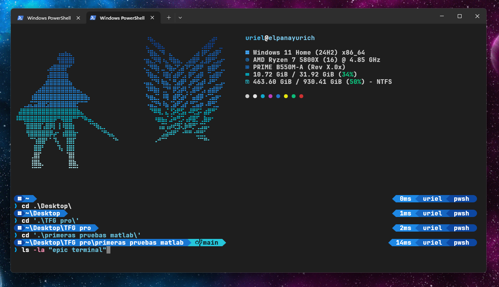

# My Personalized Windows Terminal Config



This repository contains my personal configuration for Windows Terminal, PowerShell, Oh My Posh, and Fastfetch.

## Contents

- **fastfetch/**: Configuration for `fastfetch`.
- **WindowsPowerShell/**: PowerShell profile and scripts.
- **hunk.omp.json**: Oh My Posh theme configuration.

## Installation

### 1. Install Prerequisites

Install the required tools using [Winget](https://learn.microsoft.com/en-us/windows/package-manager/winget/):

```powershell
# Install Fastfetch
winget install fastfetch

# Install Oh My Posh
winget install JanDeDobbeleer.OhMyPosh -s winget

# Install a Nerd Font (e.g., Cascadia Code NF) for the icons to work
winget install Microsoft.CascadiaCode

# Optional: Install JetBrainsMono Nerd Font (used in the included terminal settings)
# You can find it at https://www.nerdfonts.com/font-downloads or install via winget:
winget install "JetBrainsMono Nerd Font"
```

### 2. Copy Configuration Files

Clone this repo and run these commands to move the files to their correct locations:

```powershell
# Create config directory if it doesn't exist
New-Item -ItemType Directory -Force -Path "$HOME\.config"

# Copy Fastfetch config
Copy-Item -Recurse -Force .\fastfetch "$HOME\.config\"

# Copy PowerShell profile
Copy-Item -Recurse -Force .\WindowsPowerShell "$HOME\Documents\"

# Copy Oh My Posh theme
Copy-Item -Force .\hunk.omp.json "$HOME\"
```

### 3. Import Windows Terminal Settings

To get the exact same visual look (colors, fonts):

1.  Open **Windows Terminal**.
2.  Press `Ctrl` + `,` to open Settings.
3.  Click **"Open JSON file"** at the bottom left.
4.  Copy the content of `terminal-settings.json` from this repo.
5.  I have disabled transparency in my Windows 11, but you can play with it to test if you like it in the terminal settings.
6.  Paste it into your local `settings.json`, replacing the `schemes` and `profiles` sections (or the whole file if you want an exact clone).
    *   *Note: Ensure the "font" matches what you installed (e.g., JetBrainsMono Nerd Font).*

### 4. Update PowerShell Modules

### 3. Update PowerShell Modules

The profile uses `PSReadLine`. Ensure it is up to date:

```powershell
Install-Module -Name PSReadLine -AllowPrerelease -Force
```

### 4. Set Up Terminal Font

Ensure your Windows Terminal is using a **Nerd Font** (like `Cascadia Code NF`) to display the icons correctly. In my case I use JetBrainsMono Nerd Font.

## Customization

- **Theme:** Edit `hunk.omp.json` to change the prompt style.
- **Fastfetch:** Edit `fastfetch/config.jsonc` to change the system info display.
- **Profile:** Edit `WindowsPowerShell/Microsoft.PowerShell_profile.ps1` for aliases and startup logic.

## Portability Note

All configurations have been updated to use the `$HOME` variable (which points to your User Profile directory) instead of hardcoded paths. This ensures the setup works seamlessly across different machines regardless of the username.
